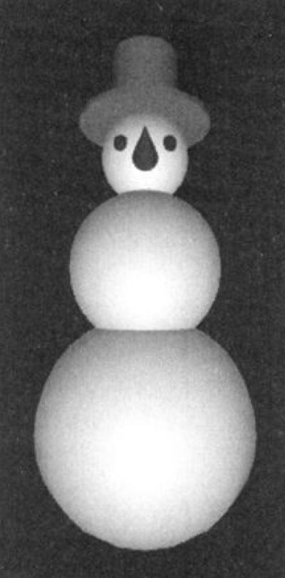

# ЗD-объекты

3D-объекты состоят из многоугольников, 
которые задаются координатами вершин, 
и описания поверхностей и нормальных векторов к ним. 

Геометрические данные трехмерных объектов - это их «физическое присутствие» на
трехмерной сцене, но не отображение.

К стандартным формам трехмерных объектов относятся такие наиболее распространенные объекты, как, например, 

- сфера
- параллелепипед
- цилиндр 
- и др.

Теперь рассмотрим, как можно использовать некоторые из этих элементов:

**Сфера** - самый простой элемент. 
Для того чтобы ее задать, необходимо только лишь указать ее радиус. 
В реальной жизни объекты в форме сфер можно встретить очень часто - это, например, 

- теннисные мячики
- бильярдные шары
- жемчуг
- воздушные шары
- и т.п.

**Параллелепипед** - встречается очень часто, и его можно использовать, например, 
для формирования основания зданий, а если поставить рядом вертикальные цилиндры, 
то может получиться что-то, похожее на древнеримское здание с колоннами.

**Тор** - из него можно сделать бублик, а также шину для велосипеда.

**Конус** - из этого объекта может получиться прекрасный стаканчик для мороженого. 
Да вы, наверное, уже заметили, что из конуса можно сделать и цилиндр - 
для чего всего лишь нужно свойствам ```topRadius``` и ```bottomRadius``` присвоить одинаковые значения.

**Плоскость** - может оказаться очень полезной для экспериментов
со светом и тенью, если расположить на ее поверхности.

Другими словами, стандартные 3D-объекты могут быть использованы
в качестве строительного материала для более сложных объектов. 
Например, из пяти сфер, двух цилиндров и одного конуса
можно составить такого вполне симпатичного снеговика




# Формат OBJ

Это очень простой текстовый формат, который был разработан компанией Wavefront Technologies, 
стал очень популярен и теперь является общепринятым форматом.
Он может импортироваться и экспортироваться практически во все популярные
программы создания 3D-графики - такие как, например, Мауа, 3ds Мах и [Blender](https://www.blender.org/download/). 
Рассмотрим формат OBJ на примере геометрического образа пирамиды. 
Пирамида - это фигура, которая имеет прямоугольное основание и четыре боковые грани, сходящиеся на вершине.


Геометрические данные для пирамиды в формате OBJ: 

```
# Blender v2.79 (sub 0) OBJ File: ''
# www.blender.org
о Shape_IndexedFaceSet
v 1.000000 -1.000000 -1.000000
v -1.000000 -1.000000 -1.000000
v -1.000000 -1.000000 1.000000
v 1.000000 -1.000000 1.000000
v 0.000000 1.000000 -0.000000
vn 0.0000 0.4472 -0.8944
vn -0.8944 0.4472 -0.0000
vn -0.0000 0.4472 0.8944
vn 0.8944 0.4472 0.0000
f 1//1 2//1 5//1
f 2//2 3//2 5//2
f 3//3 4//3 5//3
f 4//4 1//4 5//4
```

- В этом формате комментарии следуют после символа ```#```. 
- Символ ```о``` задает имя объекта. 
- За символами ```v``` следуют координаты вершин объекта. 
- Символами ```vn``` задаются описания векторов, перпендикулярных к лицевой поверхности (нормали). 
- За символом ```f``` идут описания поверхностей объекта.
