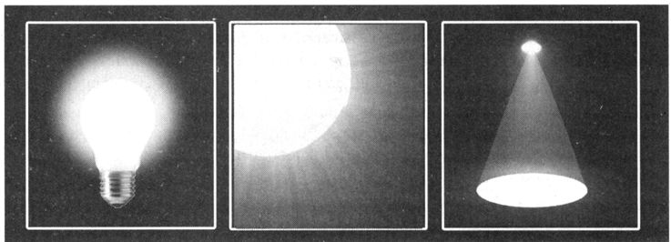

# Свет

Поскольку глубина тени 3D-объектов очень зависит от источников света, то свет играет
в процессе визуализации трехмерных сцен весьма важную роль. Именно он придает 3D-объектам
реалистичность и создает настроение восприятия всей трехмерной сцены. 

Например, чрезмерно сильно освещение может сделать сцену плоской. 

А использование света в виде луча прожектора может привлечь внимание к определенному месту сцены или объекта. 

Интенсивный цвет способен сформировать острые и четкие тени от объектов, 
а мягкий свет - более размытые, что подчеркнет пространство и создаст еще большую реалистичность восприятия.

Три вида источников света:

- точечный (point) свет (слева) - излучает свет от центра и сразу во всех направлениях. Более далеко расположенные от источника объекты освещены меньше всего. Этот тип света отлично подходит для имитации освещения от 
  - лампочки, 
  - свечи 
  - или факела;
- направленный (directional) свет (в центре) - излучает множество лучей, которые поступают извне и освещают сцену с бесконечного расстояния. Все объекты сцены получают одинаковые порции света вне зависимости от их расположения. Этот тип света подходит для имитации света от 
  - Солнца 
  - и Луны;
- прожекторный (spot) свет (справа) - излучает свет из центральной точки, лучи откуда расходятся в виде конуса. Этот тип света подходит для имитации 
  - настольных ламп, 
  - прожекторов, 
  - фар автомобилей, 
  - студийного освещения 
  - и фонарей.

Все источники света имеют общие свойства:

- цвет (color) - управление цветом освещения. Для большей реалистичности не рекомендуется использовать однотонные цвета. Например, не стоит задавать в качестве дневного цвета чисто белый цвет, будет гораздо лучше, если вы добавите к нему какой-нибудь оттенок, предположим , желтый;
- интенсивность (intensity) - yпpaвляeт яркостью освещения. Для достижения хороших результатов рекомендуется начинать с минимального значения интенсивности и понемногу ее увеличивать , пока не будет достигнут оптимальный результат.

Да будет свет!
