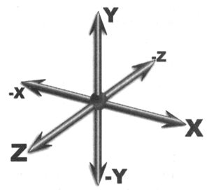

Трехмерное пространство - это естественная среда нашего обитания, в нем мы перемещаемся, взаимодействуем
друг с другом и объектами, находящимися в нем, словом, живем там. Трехмерное пространство
на дисплее компьютера или мобильного устройства - это виртуальная модель нашей
среды обитания, и оно, так же, как и реальное пространство, неограниченно велико. Для
того чтобы не потеряться и быть способным ориентироваться в виртуальном трехмерном
пространстве, для определения местоположения там необходимы три направления: Х, У и Z. 

Первое задает ширину, второе - высоту, а третье - глубину. 

**Виртуальное пространство определено сценой, в центре которой расположена начальная точка отсчета по этим направлениям.**
