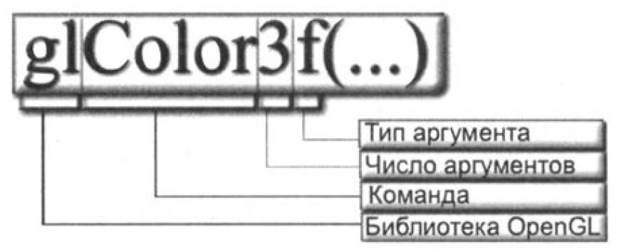

OpenGL давно используется в качестве стандартного API. Это вполне
устоявшийся стандарт, действующий уже на протяжении десятилетий.
Преимущество использования OpenGL состоит в возможности
работы с двумерной и трехмерной графикой и ее быстрого отображения.

Графическая библиотека OpeпGL - это стандарт для двумерной и трехмерной графики,
впервые введенный компанией Silicon Graphics в 1992 году. Это уже устоявшийся стандарт,
и все вносимые в него изменения делаются с учетом гарантий нормальной работы ранее
написанного кода. Сама же библиотека может быть создана кем угодно, главное, чтобы она
отвечала спецификации, установленной стандартом. С точки зрения программиста, библиотека
OpenGL представляет собой множество команд для создания объектов и выполнения
сложных операций - от сглаживания (Anti-aliasing) до наложения текстур. Для ее использования
достаточно усвоить несколько простых правил, которые обеспечат возможность
реализации замечательных программ.

Хотя OpenGL и является платформонезависимой библиотекой, но все равно, чтобы использовать
ОреnGL-программу на разных платформах, требуется провести ряд преобразований
кода программы для осуществления привязки контекста воспроизведения (rendering
context) к оконной системе платформы.

Контекст OpenGL - это набор переменных состояния.

Библиотека OpenGL не является объектно-ориентированной. При работе с библиотекой
разработчик имеет дело только с функциями, переменными и константами. Имена всех
функций OpenGL начинаются с букв gl, а констант - с GL . В имена функций входят суффиксы,
говорящие о количестве и типе передаваемых параметров. Например, прототип
функции glColorЗf () говорит о том, что в нее должны передаваться три значения с плавающей
точкой.



Поэтому при описании функций в OpenGL, чтобы не повторяться,
принято вместо числа передаваемых аргументов и их типа ставить символ *. Итак, общий
вид для упомянутой ранее функции будет выглядеть следующим образом: glColor*().
При этом подразумевается, что речь идет не об одной функции, а о целой серии функций,
начинающихся с glColor.

Типы OpenGL и символы суффиксов, используемые в ней:

| Суффикс | Тип OpeпGL | С++ Эквивалент | Описание |
| ------- | ---------  | -------------- | - |
| b       | GLbyte     | Char           | Байт |
| s       | GLshort    | Short          | Короткое целое |
| i       | GLint      | Int            | Целое |
| f       | GLfloat    | float          | С плавающей точкой |
| d       | GLdouble   | double         | С плавающей точкой двойной точности |
| ub      | GLubyte    | unsigned byte  | Байт без знака |
| us      | GLushort   | usnigned short | Короткое целое без знака |
| ui      | GLuint     | unsigned int   | Целое без знака |
| GL_     | GLenum     | Enum           | Перечисление |
| v       |            |                | Массив из n параметров |

Суффикс v говорит о том, что функция принимает массив.
Например, массив из трех значений с плавающей точкой в функцию ```glColorЗfv()``` передается
следующим образом:

```cpp
GLfloat а[] = {1.0f, O.Of, O.Of};
glColorЗfv(a);
```

Единица информации OpenGL - вершина. Перечисляя вершины, можно создавать довольно
сложные объекты.

# [Qt](qt)

- [Четырехугольник с вершинами разного цвета со сглаживанием](qt/smooth-rect-vertex-color-qt)
- [Разворачивание ОреnGL-программ во весь экран](qt/full-screen-qt)
- [Различные фигуры, построенные на одних и тех же вершинах](qt/primitives-same-vx-qt)
- [Программа, отображающая пирамиду в трехмерном пространстве, поворот которой относительно осей Х и У осуществляется при помощи мыши](qt/pyramid-qt)

## [Qt 3D](qt/qt-3d)

- [Трехмерная графика Qt ЗD построена на системе сущностей](qt/qt-3d/scene)
- [Свет](qt/qt-3d/light)
- [Камера](qt/qt-3d/camera)
- [3D-объекты](qt/qt-3d/3d-object)

# [freeglut](freeglut)

- [Application layer](freeglut/app-layer-freeglut)
- [Рендеринг сцены](freeglut/render-scene-freeglut)
- [Базовый рендеринг и освещение](freeglut/basic-render-n-light-freeglut)
- Пользовательский ввод и управление камерой
  - [freeglut](freeglut/usr-inp-n-cam-ctrl-freeglut)
  - [freeglut + Bullet](freeglut/usr-inp-n-cam-ctrl-freeglut-bullet)

# Misc.

- [Движение сферы по кривой](solid-sphere-animation)
- [Отскакивающий шар](bouncing-ball)
