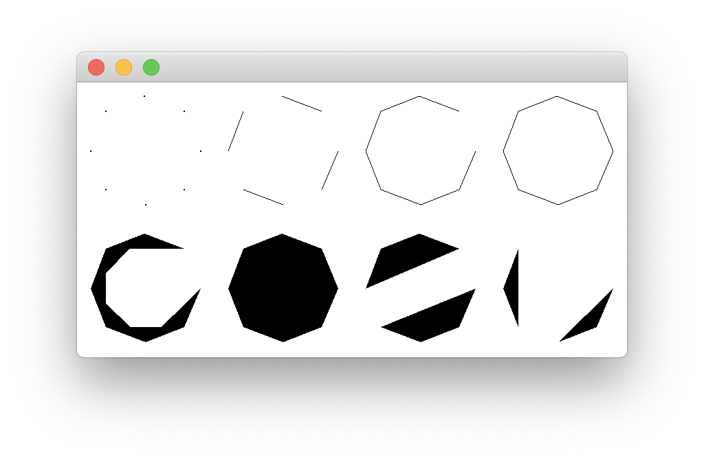

OpenGL предоставляет средства для рисования графических примитивов, таких как 

- точки,
- линии, 
- ломаные 
- и многоугольники, 

которые задаются одной или несколькими вершинами.

Для этого необходимо передать список вершин.

Следующий пример формирует различные фигуры, построенные на одних и тех же вершинах.

