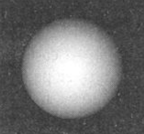
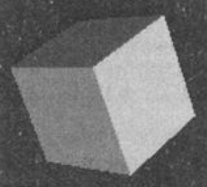
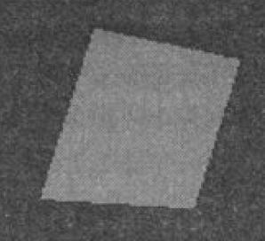
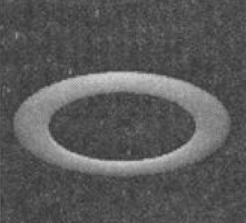
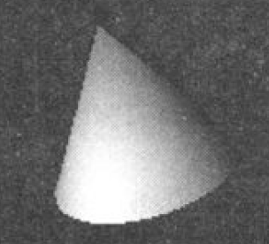
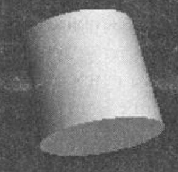

# 3D-объекты

Для загрузки 3D-объектов Qt 3D использует формат OBJ. 
Благодаря поддержке формата OBJ в Qt ЗD можно загружать геометрические данные
трехмерных объектов из разных редакторов, используемых для создания трехмерной
графики.

Загружать данные из ОВJ-файлов позволяет элемент ```Mesh```.

```
Mesh {
    id: mesh
    source: "pyramid.obj"
}
```

Совсем необязательно создавать элемент Mesh и загружать геометрии объектов. 
Модуль ```Qt3D.Extras``` предоставляет коллекцию стандартных форм трехмерных объектов
- таких как сфера, конус, тор и т.п., которые можно сразу использовать в своих программах.

## Сфера

```
SphereMesh {
    radius: 3  // радиус
}
```



## Параллелепипед

```
CuboidМesh {
    // размеры лицевых сторон
    yzMeshResolution: Qt.size(2, 2)
    xzMeshResolution: Qt.size(2, 2)
    xyMeshResolution: Qt.size(2, 2)
}
```



## Плоскость

```
PlaneMesh {
    width: 50   // ширина
    height: 50  // высота
}
```



## Тор

```
TorusMesh {
    radius: 5       // внешний радиус
    minorRadius: 1  // внутренний радиус
    rings: 100      // количество колец //корпуса
}
```



## Конус

```
ConeMesh {
    topRadius: 0     // радиус верхнего основания
    bottomRadius: 1  // радиус нижнего основания
    length: 3        // высота
    rings: 50        // количество колец корпуса
}
```



## Цилиндр

```
CylinderMesh {
    radius: 1   // радиус оснований
    length: 3   // высота
    rings: 100  // количество колец корпуса
}
```


