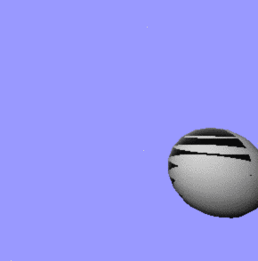

OpenGL это не scene graph. 
Все что он делает это раскрашивает пиксели.
После того как OpenGL обработал переданную ему геометрию, все забывается,
остаются только изменения (traces) во framebuffer.
Содержимое Vertex Buffer Objects само по себе не является геометрией.
Только drawing calls (glDrawElements, glDrawArrays) превращают значения
из буфера вершин (vertex buffer) в геометрию.